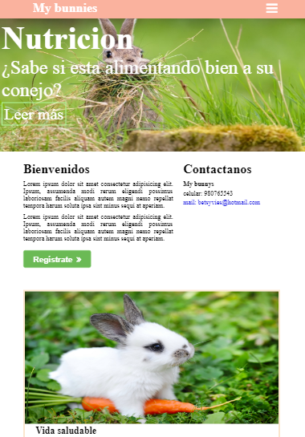

# My Bunnies

## Objetivo

- El objetivo es crear una página a gusto del programador, manteniendo la estructura del modelo dado y realizandolo con un grid (cualquiera pero que no sea un framework como Bootstrap o Materialize).

## Flujo de trabajo

- Primero creamos la estructura HTML, en forma anidada.
- Comentar el código.
- Enlazamos el archivo externo del CSS, esto para un mayor orden y hacer uso de las buenas practicas.
- Luego continuamos trabajando en CSS y con los grids.
- Comentar el código.
- Subimos avances a github.
- Terminar de dar estilo con CSS.
- Empezamos a trabajar con los media queries, para adaptar las vistas a la ventana del navegador.
- Comentar el código.
- Subimos avances a github.
- Cumplimos con el objetivo.
- Digitar el archivo README.md
- Subir el producto final a github.
- Crear la rama "gh-pages".

## Herramientas Utilizadas

- html, para la estructura del contenido.
- css, para darle estilo al contenido.
- media queries y grid, para hacer la pagina responsive.

## Fuente consultada

- [Laboratoria LMS] : https://lms.laboratoria.la/cohorts/lim-2017-09-bc-core-pm/courses/social-network/00-rwd/00-opening
- [MDN web] : https://developer.mozilla.org/es/docs/Web/HTML/Elemento/input/Botón
- [MDN web] : https://developer.mozilla.org/es/docs/Web/CSS/CSS_Flexible_Box_Layout/Usando_las_cajas_flexibles_CSS

## Imagenes  
- Estructura dada - vista desk

- Estructura de la página - vista desk

- Estructura dada - vista cell

- Estructura de la página - vista cell

- Adicional - vista tablet

